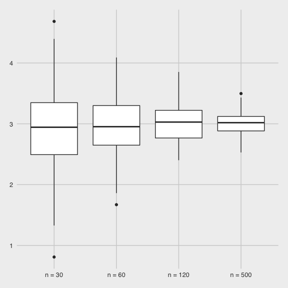

simulation
================
Alexey Abramov
11/9/2020

  - [Setup](#setup)

# Setup

``` r
library(tidyverse)
```

    ## ── Attaching packages ──────────────────────────────────────────────── tidyverse 1.3.0 ──

    ## ✓ ggplot2 3.3.2     ✓ purrr   0.3.4
    ## ✓ tibble  3.0.3     ✓ dplyr   1.0.2
    ## ✓ tidyr   1.1.2     ✓ stringr 1.4.0
    ## ✓ readr   1.3.1     ✓ forcats 0.5.0

    ## ── Conflicts ─────────────────────────────────────────────────── tidyverse_conflicts() ──
    ## x dplyr::filter() masks stats::filter()
    ## x dplyr::lag()    masks stats::lag()

``` r
library(rvest)
```

    ## Loading required package: xml2

    ## 
    ## Attaching package: 'rvest'

    ## The following object is masked from 'package:purrr':
    ## 
    ##     pluck

    ## The following object is masked from 'package:readr':
    ## 
    ##     guess_encoding

``` r
knitr::opts_chunk$set(
  fig.width = 6,
  fig.height = 6,
  out.width = "90%"
)

theme_set(
  ggthemes::theme_fivethirtyeight() + theme(legend.position = "bottom")
  )

options(
  ggplot2.continuous.colour = "viridis",
  ggplot2.continuous.colour = "viridis"
)

scale_colour_discrete = scale_color_viridis_d
scale_fill_discrete = scale_fill_viridis_d

set.seed(1)
```

Examples

``` r
sim_mean_sd = function(samp_size, mu = 3, sigma = 4) {
  sim_data = 
    tibble(
      x = rnorm(n = samp_size, mean = mu, sd = sigma)
    )

  sim_data %>% 
    summarize(
      mean = mean(x),
      sd = sd(x)
    )
}
```

I can “simulate” this

``` r
sim_mean_sd(30)
```

    ## # A tibble: 1 x 2
    ##    mean    sd
    ##   <dbl> <dbl>
    ## 1  3.33  3.70

But now let’s really do it with a for loop.

``` r
output = vector("list", length = 100)

for (i in 1:100) {
  output[[i]] = sim_mean_sd(samp_size = 30)
}

bind_rows(output)
```

    ## # A tibble: 100 x 2
    ##     mean    sd
    ##    <dbl> <dbl>
    ##  1  3.53  3.18
    ##  2  3.44  3.84
    ##  3  3.45  3.53
    ##  4  1.68  3.69
    ##  5  3.95  4.22
    ##  6  3.27  4.34
    ##  7  2.05  4.05
    ##  8  3.10  3.72
    ##  9  3.55  4.11
    ## 10  3.87  3.79
    ## # … with 90 more rows

Lets use a loop function.

``` r
sim_results =
  rerun(100, sim_mean_sd(samp_size =30)) %>% 
  bind_rows()
```

Let’s try other sample sizes n = 30 is the name of the elements in the
list.

``` r
n_list = 
  list(
    "n = 30" = 30,
    "n = 60" = 60,
    "n = 120" = 120,
    "n = 500" = 500)

output = vector("list", length = 4)

output[[1]] = rerun(100, sim_mean_sd(samp_size = n_list[[1]])) %>% 
  bind_rows()
```

Now a for loop\!

``` r
for (i in 1:4) {
  
  output[[i]] = rerun(100, sim_mean_sd(samp_size = n_list[[i]])) %>% 
  bind_rows()
  
}
```

.x is the argument that goes INSIDE of rerun function Rerun here is
spitting out lists and now into a dataframe And now we want to UN-NEST
it

``` r
sim_results = 
  tibble(
  sample_size = c(30, 60, 120, 500)) %>% 
    mutate(
      output_lists = map(.x = sample_size, ~ rerun(100, sim_mean_sd(.x))),
      estimate_df = map(output_lists, bind_rows)
      ) %>% 
  select(-output_lists) %>% 
  unnest(estimate_df)
```

Do some dataframe things

Rename the sample\_size column And reorder them

``` r
sim_results %>% 
  mutate(
    sample_size = str_c("n = ", sample_size),
    sample_size = fct_inorder(sample_size)
  ) %>% 
  ggplot(aes(x = sample_size, y = mean)) +
  geom_boxplot()
```



Summarize

``` r
sim_results %>% 
  group_by(sample_size) %>% 
  summarize(
      avg_sample_mean = mean(mean),
      sd_sample_mean = sd(mean)
      )
```

    ## `summarise()` ungrouping output (override with `.groups` argument)

    ## # A tibble: 4 x 3
    ##   sample_size avg_sample_mean sd_sample_mean
    ##         <dbl>           <dbl>          <dbl>
    ## 1          30            2.94          0.722
    ## 2          60            2.97          0.486
    ## 3         120            3.02          0.344
    ## 4         500            3.02          0.174
